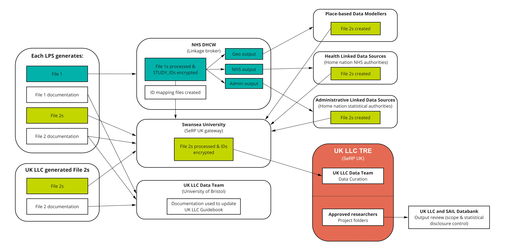

# Appendix A: UK LLC Data Flows
>Last modified: 20 May 2026

<strong>A 'split-file' anonymisation process is used to securely transfer all datasets from contributing LPS into the TRE.</strong>

 

Importantly, this 'split-file' anonymisation process restricts the handling and management of LPS participants' personal identifiers to:
* the contributing LPS,
* NHS Digital Health and Care Wales (UK LLC's trusted third party/linkage broker),
* the linked data owners, and 
* the contracted geo-data modellers. 

Staff at Swansea University and University of Bristol, and researchers approved to access data in the TRE, only have access to the de-identified data. 

For UK LLC **data flow diagrams** visit: [Partnering with UK LLC - Resource Hub](https://resourcehub.ukllc.ac.uk/data%20flow%20diagrams)  

For more information on **NHS England data linkage** visit: [Processing and linkage to NHS England datasets](https://guidebook.ukllc.ac.uk/docs/linked_health_data/nhs_england/linkage_and_processing/linkage_processing)  

For more information on **NHS Wales data linkage** visit: [Processing and linkage to NHS Wales datasets](https://guidebook.ukllc.ac.uk/docs/linked_health_data/nhs_wales/linkage_and_processing/linkage_processing_nhsw)  

For more information on **Place-based data linkage** visit: [Processing linkage to place-based datasets](https://guidebook.ukllc.ac.uk/docs/linked_geo_data/place_based_intro)  

File 1s are processed by NHS DHCW who:  
1. Reformat and send the identifiers to linkage partners and data sources to establish linkages.
2. Provide an automated file of de-identified participant permission status and linkage field quality indicators (reporting if an identifier was present in the file or not) to Swansea.
3. De-duplicate each LPS participant's identifiers into a single file of unique individuals.
4. Encrypt the study identifiers used into a unique UK LLC person ID and encrypt property details into a UK LLC property ID (TBC). These IDs are shared with Swansea University who encrypt them again before providing the IDs to UK LLC.

