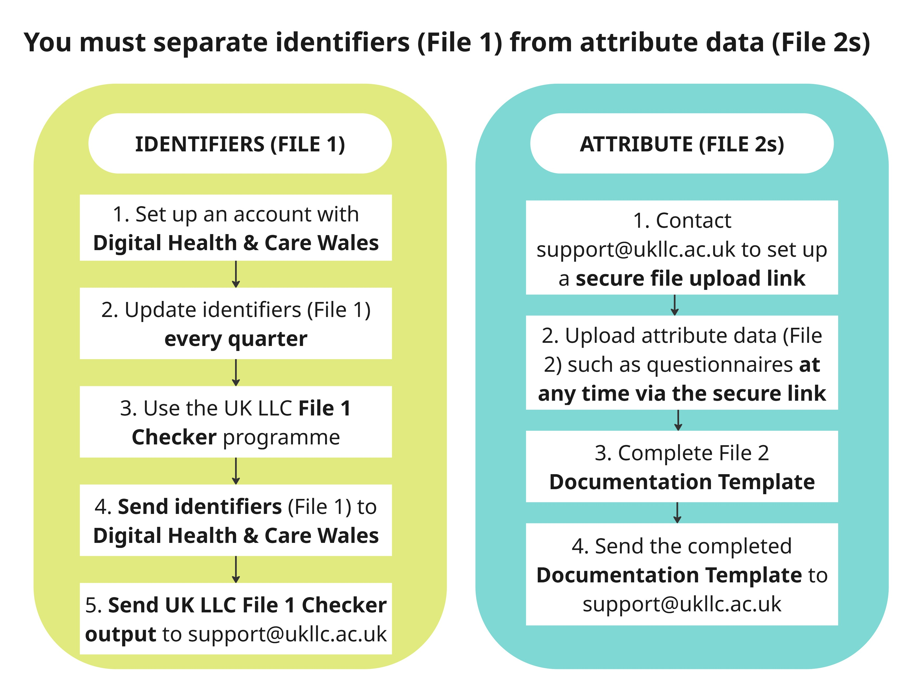

# Format of Data Files

This guide is written for Longitudinal Population Study (LPS) Data Managers.
The guide explains:

1. The specifications for the data files that must be adhered to when sending data to be ingested to the UK LLC Trusted Research Environment (TRE).
2. Which organisations to send the data and documentation files to and the methods of data transfer.

A full explanation of this 'split-file' process and UK LLC data flows is in  **Appendix A**.  

 

 

## You can contact the UK LLC Data Team with any data-related queries at: [support@ukllc.ac.uk](mailto:support@ukllc.ac.uk).