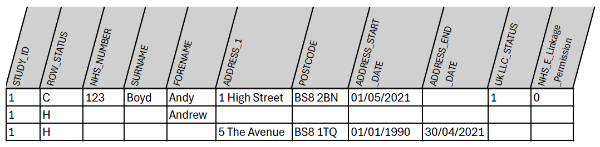
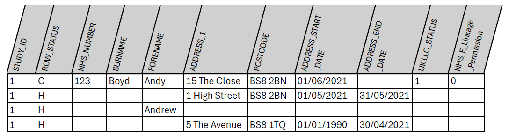

# File 1 specification

**The File 1 format allows multiple rows of data per participant**, where each row reflects change or multiple values for NHS ID, surname, forename or address values (with start and finish dates).  
 
**Each participant must have a 'current row' where all variables are populated with the best estimate of CURRENT information (ROW_STATUS=C)** and then subsequent rows (with the same participant STUDY_ID number) populated with the alternative HISTORICAL value(s) only (ROW_STATUS=H), leaving all other values as null. For historical addresses please populate all address and postcode fields and the start/end date fields (see Table 1).  

If a participant withdraws from the LPS or no longer permits the flow of their identifiers for linkage, you must set their permission flags in the 'current' row accordingly to stop their data flowing. For example, if a participant withdraws consent to share their data with UK LLC, set their UKLLC_STATUS to 0 in the 'current row'.

<i>**Table 1**: Example File 1 content for a single fabricated LPS participant - in this example a limited number of variables is shown (see the [**File 1 formatting table**](file1_format_table.md) for the full list)</i>

When an updated File 1 is provided, this should be build using the information that is current at the time – i.e. any new information, such as a new address, will be added to the 'current' row, and old information will be relegated to the 'historical' row(s) – see example in Table 2.

<i>**Table 2**: Example of updates in File 1 content (new address) for the same fabricated LPS participant</i>  

## Permission flags  
There are 34 fields that should be completed, including permission flags. These are described in the [**File 1 formatting table**](file1_format_table.md).  

Permission flags indicate if a participant’s identifiers can be shared for [**linkages**](#permission-flags) and with whom. Flags can be set at an **individual participant level** or at an **LPS level**. In Table 1 above, the participant with STUDY_ID 1 (Andy Boyd) has consented to have data flow to UK LLC (UKLLC_STATUS=1), but has not consented to NHS England Linkage (NHS_E_Linkage_Permission=0).

## Linkages
If indicated by the **NHS_E_Linkage_Permission** field and **NHS_W_Linkage_Permission** field, participants are linked with their English health records (NHS England) and Welsh health records (NHS Wales), respectively. There are ongoing discussions to also flow Scottish (Public Health Scotland) and Northern Irish (Health & Social Care Northern Ireland) NHS records into the UK LLC TRE.  

Where an LPS has already linked their cohort with an NHS agency, then they should include participants’ NHS Digital study number so that the existing linkage can be replicated for UK LLC. This will be efficient and aid consistency of linkages across different datasets.  

N.B. UK LLC is also finalising an agreement to link to non-health administrative records from the Department for Work and Pensions (DWP), HM Revenue and Customs (HMRC) and Department for Education (DfE) via the Office for National Statistics (ONS).  

We acknowledge that there will be instances where data may be incomplete, e.g. missing day of birth; gaps in timeline of past addresses; missing or incomplete start and end dates for addresses. **Any information you can provide is helpful, even incomplete NHS numbers (if allowed by your DSA with NHS England)**. When these data are used for performing linkage, partial information can increase the chance of linkages being successful.  

## Place-based data
There are four place-based permission flags that specify if the study approves the following linkages:  
a. Geocoding_Permission  
b. Small_Area_Permission  
c. Environment_Permission  
d. Property_Level_Permission  

More information on each of these is provided in lines 26 – 29 of the [**File 1 formatting table**](file1_format_table.md).  

If indicated by the **Geocoding_Permission** field, participants’ address history is shared by DHCW, masked by the inclusion of additional addresses, with agreed partners for linkage to geocoded data. The partners do not receive any information except encrypted STUDY_ID, full address or postcode, and address start and finish dates. For more information on place-based data processing and linkage visit [**UK LLC Guidebook**](https://guidebook.ukllc.ac.uk/docs/linked_geo_data/place_based_intro).  

Address start and end dates are used, e.g. to calculate exposure to air pollution. In these cases, even incomplete temporal information is of use, so providing the year of start and end at a residence is of value and will allow for more accurate calculations of air pollution exposure.

## File 1 formatting
The personal identifiers data file (File 1) should be provided in .csv (comma delimited file) format. If your exported .csv file has empty cells with spaces, please delete these spaces, setting the values of the empty cells to null/empty.  

Please refer to the [**File 1 formatting table**](file1_format_table.md),  for detailed information about each variable to be included in each File 1.  

**You MUST use the Field Names in the [File 1 formatting table](file1_format_table.md) and Field Names MUST have underscores between words.**